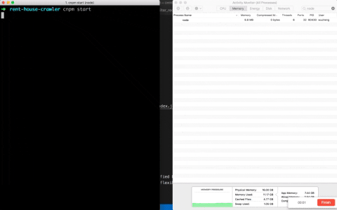
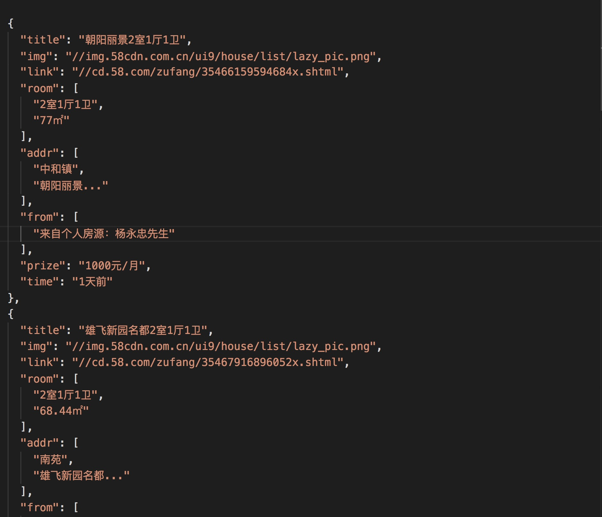

# 58租房快速查询
开源的目的只希望能够帮助到真正需要的人，帮你快速找到物美价廉的房子。

我也是租房子的时候，希望快速找到自己觉得不错又物美价廉的房子。但是鉴于58一个界面提供的信息是在太少，于是一次性找个几百条然后通过 filter 过滤后，再去找，效率大增。


# Features
+ 快捷租房查询，记录根据条件快速筛选出符合条件的房子。
+ 根据你关心的条件获得匹配的房子链接，还可以自定义`filters`函数用你的规则过滤。
+ 简单的[自定义配置](./config/index.js) 。


# Screenshots

+ 首先安装依赖
```bash
npm install
```

+ 获取特定地区和经过特定条件筛选后的url，修改[config](./config/index.js)中的`url`为你复制的地址


+ 执行 `npm run start` 运行脚本



+ 符合[filter](./filters/filter58.js)条件的房子会记录保存在[records/filter_records.log]('./records/filter_records.log)中




# Tools
- [nodejs](https://nodejs.org/)
- [request](https://www.npmjs.com/package/request) - Simplified HTTP request client.
- [cheerio](https://www.npmjs.com/package/cheerio) - Fast, flexible & lean implementation of core jQuery designed specifically for the server.


# TODO
+ 通过命令行输入条件做到手动复制地址，一键生成地址。
+ 代理切换，验证识别。防止被反爬虫机制检测。
+ ^_^ 懒啊～～


# license
[MIT](https://opensource.org/licenses/MIT)


# thanks
旧瓶装新酒，算是`nodeJS`版本的实现之一。
